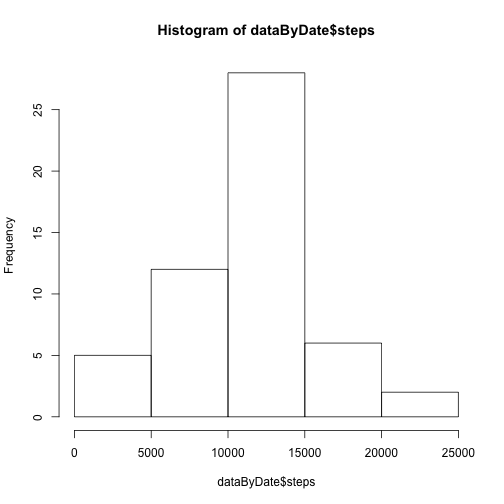
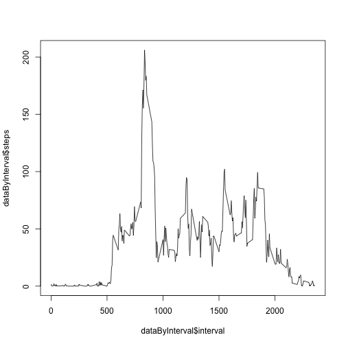
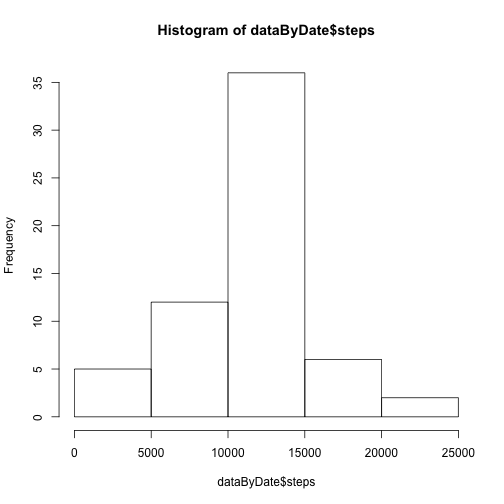
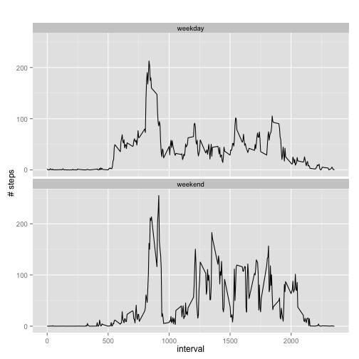

## Loading and preprocessing the data

```r
unzip("activity.zip") 
dataNA<-read.csv("activity.csv")
data<-na.omit(dataNA)


dataByDate<-aggregate(steps ~ date, data, sum)

hist(dataByDate$steps)
```

 

## What is mean total number of steps taken per day?


```r
summary(dataByDate)
```

```
##          date        steps      
##  2012-10-02: 1   Min.   :   41  
##  2012-10-03: 1   1st Qu.: 8841  
##  2012-10-04: 1   Median :10765  
##  2012-10-05: 1   Mean   :10766  
##  2012-10-06: 1   3rd Qu.:13294  
##  2012-10-07: 1   Max.   :21194  
##  (Other)   :47
```

## What is the average daily activity pattern?


```r
dataByInterval<-aggregate(steps ~ interval, data, mean)
plot(dataByInterval$interval, dataByInterval$steps, type="l")
```

 

```r
dataByInterval$interval[dataByInterval$steps==max(dataByInterval$steps)]
```

```
## [1] 835
```

## Imputing missing values


```r
sum(is.na(dataNA))
```

```
## [1] 2304
```

```r
newDataNA<-dataNA

x<-0


for (i in 1:nrow(dataNA)){
  if (is.na(dataNA$steps[i])){
    newDataNA$steps[i]<-round(dataByInterval$steps[dataByInterval$interval==dataNA$interval[i]],0)
  }
}

dataByDate<-aggregate(steps ~ date, newDataNA, sum)

hist(dataByDate$steps)
```

 

```r
summary(dataByDate)
```

```
##          date        steps      
##  2012-10-01: 1   Min.   :   41  
##  2012-10-02: 1   1st Qu.: 9819  
##  2012-10-03: 1   Median :10762  
##  2012-10-04: 1   Mean   :10766  
##  2012-10-05: 1   3rd Qu.:12811  
##  2012-10-06: 1   Max.   :21194  
##  (Other)   :55
```

## Are there differences in activity patterns between weekdays and weekends?


```r
data<-newDataNA

library(lubridate)
data$weekday <- wday(as.Date(data$date))-1
data$weektype[data$weekday<6]<-"weekday"
data$weektype[data$weekday>5]<-"weekend"

dataByWeektype <- aggregate(steps ~ interval + weektype, data, mean)

library(ggplot2)
qplot(interval, 
      steps, 
      data = dataByWeektype, 
      geom=c("line"),
      xlab = "interval", 
      ylab = "# steps", 
      main = "") +
  facet_wrap(~ weektype, ncol = 1)
```

 
